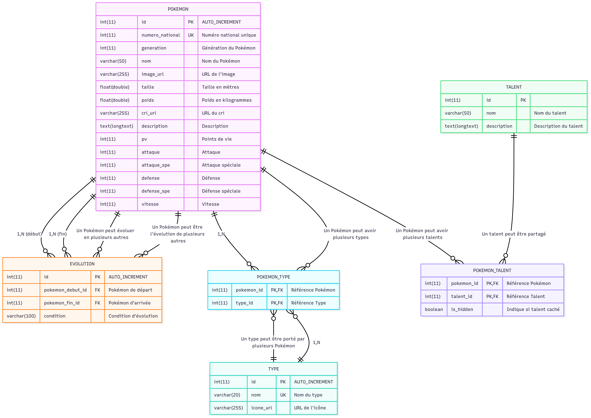
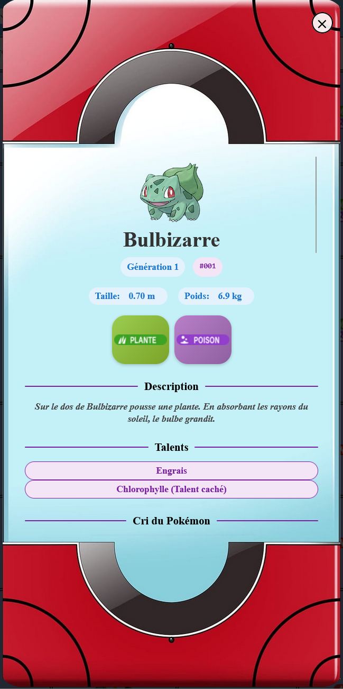

# Pokédex Symfony

Bienvenue sur le repository de **Pokédex Symfony**, un projet complet de Pokédex web respectant la structure des jeux vidéos Pokémon : consultation avancée, stats détaillées, talents et évolutions, en version responsive et moderne.

## ✨ Présentation

Ce projet a pour but de fournir une base de données exhaustive et interactive sur les Pokémon, développée avec Symfony et pensée pour être facilement étendue.  
Il met en avant :

- Toutes les informations officielles (stats, tailles, descriptions…)
- La gestion des talents avec différenciation du talent caché
- L’affichage en popup responsive, moderne et illustré
- Un back-end API prêt à l’emploi (édition par SQL pour l’instant)
- Une ergonomie "mobile first", totalement adaptée aux écrans PC ou tablette

## 🗃️ Structure technique

Le projet suit les meilleures pratiques Symfony et utilise une modélisation des données relationnelle claire, fidèle à la logique du Pokédex.

### 📦 Arborescence principale :

```
text
/assets
    MPD.png    # <-- Modèle Physique des Données (voir ci-dessous)
/public
    /css
    /js
/src
    /controller
    /entity
    /repository
/templates
    /pokedex
```

## 🗺️ Modèle Physique des Données (MPD)

Le schéma relationnel du projet (MPD) détaille toutes les entités, leurs attributs et relations :



Les entités principales :

- **POKEMON** : toutes les infos et statistiques propres à une créature  
- **TALENT** : un référentiel unique de tous les talents existants dans Pokémon  
- **POKEMON_TALENT** : la table de liaison, permettant d’indiquer si le talent est caché (`is_hidden`)  
- **TYPE**, **POKEMON_TYPE**, **EVOLUTION** : relations ManyToMany pour gérer types et évolutions

> Le MPD complet est consultable dans le dossier `/assets/MPD.png` du repository.  
> Il a été généré à partir de code Mermaid / DB diagram.

## 🚀 Déploiement local

1. **Cloner le dépôt** :

```
git clone https://github.com/tonuser/pokedex-symfony.git
cd pokedex-symfony
```

2. **Installer les dépendances** :

```
composer install
yarn install    # ou npm install
```

3. **Configurer l’environnement** – par exemple :

```
cp .env .env.local
Modifiez les variables de connexion à la base de données dans .env.local.
```

4. **Créer les tables et charger les données :**

- Générer la base de données :

```
php bin/console doctrine:schema:update --force
```
Charger le MPD (MPD.png) dans votre outil favori si besoin pour consulter le modèle.

5. **Démarrer l’application** via Symfony Server ou Apache/Nginx.

## 🖼️ Capture d’écran



## 🤖 Attributions
- Schéma MPD généré avec Mermaid Live Editor et converti en PNG.

- Données officielles issues de Poképédia, PokéAPI, ainsi que la base de données officielle de The Pokémon Company.

## 📝 Notes

- Pour toute question sur le schéma MPD, se référer au fichier /assets/MPD.png.

- Modification des données Pokémon/Talents : directement en SQL (script d'insertion de tous les talents disponible dans /assets/Script SQL d'insertion de talents Pokémon.txt).